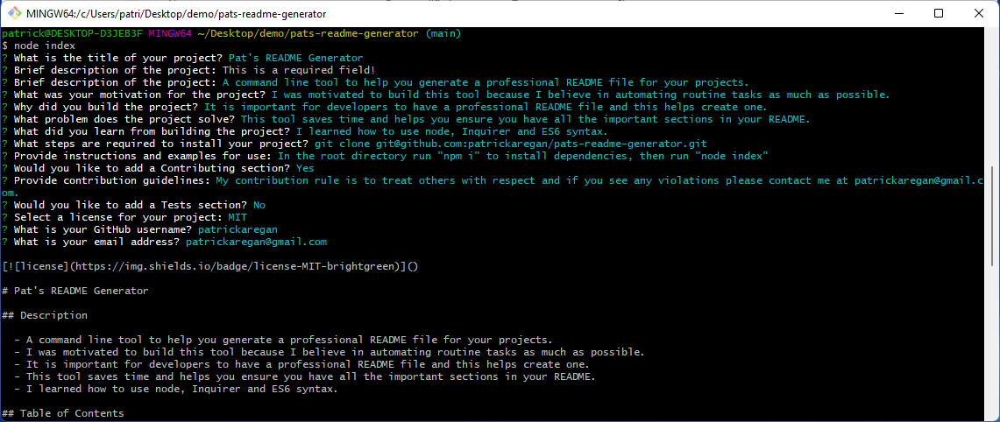

# Pat's README Generator

## Description

  - A command line tool to help you generate a professional README file for your projects.
  - I was motivated to build this tool because I believe in automating routine tasks as much as possible.
  - It is important for developers to have a professional README file and this helps create one.
  - This tool saves time and helps you ensure you have all the important sections in your README.
  - I learned how to use node, Inquirer and ES6 syntax.

## Table of Contents

  - [Installation](#installation)
  - [Usage](#usage)
  - [License](#license)
  - [Contributing](#contributing)
  
  - [Questions](#questions)

## Installation

  - git clone git@github.com:patrickaregan/pats-readme-generator.git

## Usage

  - In the root directory run "npm i" to install dependencies, then run "node index"
  
  
  - [Watch a demo video](https://drive.google.com/file/d/1YDGHhnH2Csw6T1Zm3H4JnyebANrntva4/view)

## License

  - MIT

## Contributing

  - My contribution rule is to treat others with respect and if you see any violations please contact me at patrickaregan@gmail.com.  
  

## Questions

- [GitHub Profile](https://github.com/patrickaregan)
- If you have additional questions please email me at patrickaregan@gmail.com

